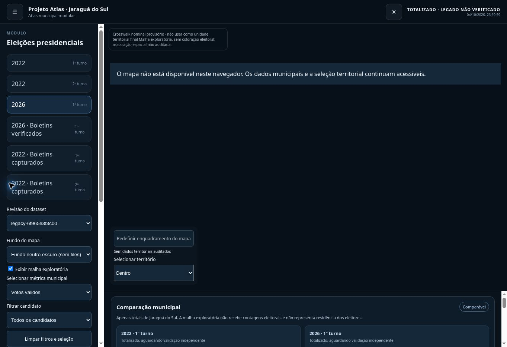

# Implementação das pendências do roadmap v3.2 — 2026-10-08

Registro consolidado em 09/10/2026; as execuções e a inspeção abaixo ocorreram em 08/10/2026.

Esta entrega implementa as pendências técnicas reproduzíveis da auditoria. Não declara a versão v0.3.0 concluída nem autoriza resultados por bairro.

| Área | Alteração e evidência |
|---|---|
| Proveniência | Migrações legadas geram `sourceStatus: unverified-legacy`, nunca `official`; input ausente não cria saída. |
| Fontes 2022/2026 | Três ZIPs estaduais capturados; hashes revalidados antes da extração; recortes municipais comprimidos e manifestos persistidos no Git. Em 2022 os hashes são da captura, sem digest oficial independente confirmado. Testes reproduzem payloads e catálogos dos três recortes. |
| Divergência | BU nominal 108.638 versus legado 108.628. Número 28 tem dez votos no BU e está ausente do legado. Demais candidatos coincidem. Estado jurídico/final não inferido; métricas distintas não se comparam. |
| Revisões | Registro mantém id/revisão e rejeita reutilização com checksum diferente. Links fixos e cópias de revisões são preservados; geradores arquivam saídas. Seletores permitem escolher revisão do dataset e da referência de comparação; `compareRevision` fixa o segundo lado e revisão desconhecida bloqueia a comparação. |
| Integridade | DataLoader valida os bytes antes do JSON, incluindo catálogos; Zod valida registry, AST de métricas, descritores, estrutura, unicidade e reconciliação. Dataset ou catálogo adulterado falha sem exibir totais. |
| Contratos | Fonte/derivação tipadas; `official` exige evidência e reconciliação; associação revisada exige evidenceRef e não pode ser ambígua. |
| Core/web | Runtime, Registry, DataLoader, MetricEngine, MapEngine, LayerManager, InteractionManager, Router e i18n integrados. Agregação/ranking de candidatos movidos para domain-elections. Fixture não eleitoral validada no frontend, mapa/KPI/URL e E2E. |
| Análise | Métrica municipal, filtro de candidato, reset, brancos/nulos/aptos/comparecimento e denominador explícito. Catálogos 2022 capturados e vinculados separadamente dos votos legados. BU tem inspector de seção e identificador de local. Catálogo parcial não oculta votos sem nome. Comparador distingue estágio e votos nominais. |
| Estado | AtlasStore integra o estado. Dataset, revisão, comparação, métrica, candidato, seleção territorial, tema, painel, fundo neutro e camada preservados em URL. Teste verifica mudança da revisão antiga para a atual do mesmo dataset. |
| Mapa | Fundo neutro claro/escuro, visibilidade da malha, reset da vista, zoom, seleção com mouse/toque/teclado e baselines visuais desktop/mobile. Controles alterados durante o carregamento são aplicados ao mapa. |
| Acessibilidade | Temas claro/escuro; contraste do tema claro corrigido com axe; seleção por teclado, menu inert e ausência de WebGL mantidos. Selects da comparação e revisão cabem na largura útil da sidebar, com teste de overflow interno desktop/mobile. |
| Publicação | CSP compatível com workers, lint AST com allowlist documentada e budgets automatizados; Pages passa a depender da fundação, contratos, payloads, Vitest e E2E. WebKit desktop/iPhone adicionado ao gate. Smoke pós-deploy testa a URL publicada em desktop/mobile e preserva screenshots/traces como artefato. |

Validação local: build de produção; fundação, contratos com 10 válidos e 4 inválidos; 21 testes core, 20 testes Vitest e 42 E2E Chromium desktop/mobile. WebKit não executa neste ambiente por bibliotecas de sistema ausentes; os dois testes WebKit passaram no Actions sobre o último commit de aplicação. A publicação e os seis smokes do site público também passaram.

Budgets: JS inicial gzip <=110.000 bytes; chunk de mapa gzip <=300.000 bytes; worker <=520.000 bytes. São limites de artefatos medidos, não alegação de desempenho em campo.

## Pendências que permanecem explícitas

- A licença e a precisão da geometria legada, coordenadas de locais de votação e crosswalk espacial não foram comprovados. Malha permanece exploratória e sem votos.
- Explicação oficial para classificação dos dez votos do número 28 e resultado final homologado ainda depende de fonte adequada. BU não ganha selo de resultado oficial final.
- Preservação permanente do ZIP estadual integral fora de artefatos temporários; o recorte municipal e manifesto estão no Git.
- Desempenho de campo e exercício real de rollback não foram concluídos. As camadas/fundos disponíveis e a regressão visual são testados; novas fontes de cartografia dependem de licença e validação geoespacial.
- Não há dados inventados para segundo turno 2026, bairros ou partidos ausentes do catálogo.

A auditoria anterior é histórica. Este documento e os links de execução posteriores representam o estado desta entrega. [Reconciliação da fonte](bu-source-reconciliation.md).

## Aderência por fase após implementação

| Fase | Resultado nesta entrega | Limite de aceite |
|---|---|---|
| F0 | Capturas, digests, recortes reproduzíveis e cadeia de proveniência | Licença cartográfica, completude externa e retenção dos ZIPs integrais pendentes |
| F1 | Schemas/Zod, rejeição de adulteração, status tipados, evidência de crosswalk | Contratos não certificam uma associação espacial inexistente |
| F2 | Build, lint AST, budgets e gates de publicação executáveis | Release v0.3.0 depende dos critérios restantes |
| F2.5 | Seleção acessível; inspector por seção BU; fixture com clique/toque e KPI | Inspector eleitoral geográfico depende de crosswalk auditado |
| F3 | Dois turnos de 2022 capturados e derivados por seção; catálogos vinculados | Digest oficial independente e completude contra universo externo não confirmados |
| F4 | 2026 derivado do snapshot e reconciliado internamente | Dez votos nominais adicionais ao legado; causa jurídica/final não inferida |
| F5 | Core integrado à web e prova de módulo não eleitoral no navegador | Fixture é artificial, não uma nova fonte estatística |
| F6 | Filtros, métricas, denominadores, catálogo, inspector e revisões dos dois lados | Comparação BU provisória e resultados por bairro seguem bloqueados |
| F7 | Temas, teclado, URL, camadas e testes desktop/mobile Chromium/WebKit | Sem certificação WCAG completa nem avaliação em aparelhos físicos |
| F8 | Fundo neutro, camada exploratória, atribuição e reset | Sem malha oficial/licenciada, coordenadas auditadas ou crosswalk aprovado |
| F9 | CSP, regressão visual, orçamento de assets, deploy e smoke público | Desempenho de campo e rollback real pendentes |

O padrão do site mantém os votos legados explicitamente não verificados. As capturas BU são períodos próprios, com estado provisório e denominador nominal. A revisão histórica usada nos testes é uma fixture; os arquivos reais preservados não demonstram uma série longitudinal completa de atualizações do TSE. Governança futura de changelogs por dataset/configuração e cadeias reais de `supersedes` precisa ser exercitada quando novas revisões forem incorporadas.

## Publicação confirmada

Commit de aplicação publicado: [`c23b39347dc689ae0ba619a3d010b20ebaeb2dfc`](https://github.com/alldevitone-maker/Atlas-Project/commit/c23b39347dc689ae0ba619a3d010b20ebaeb2dfc). A documentação de evidência pode ter um commit posterior; não altera os assets desta publicação.

| Execução | Resultado |
|---|---|
| [Fundação / CI](https://github.com/alldevitone-maker/Atlas-Project/actions/runs/37851415109) | PASS; 21 core, tipos, schemas, AST e hashes |
| [Web build](https://github.com/alldevitone-maker/Atlas-Project/actions/runs/37851415250) | PASS; build e 20 Vitest |
| [Browser E2E](https://github.com/alldevitone-maker/Atlas-Project/actions/runs/37851415120) | PASS; 42 Chromium + 2 WebKit, desktop/mobile |
| [Gates / deploy / smoke público](https://github.com/alldevitone-maker/Atlas-Project/actions/runs/37851415148) | PASS; build, deploy e 6 smokes da URL publicada |

[Site publicado](https://alldevitone-maker.github.io/Atlas-Project/) · [Evidência estruturada](evidence/release-validation-2026-10-08.json) · [Detalhes do build](build-status.md).

Budgets conferidos no Actions: JS inicial gzip **104.048/110.000 bytes**, mapa gzip **279.546/300.000**, worker **507.770/520.000**. As verificações incluem adulteração de payload/catálogo, revisões indisponíveis, métricas incompatíveis, teclado, clique/toque, contraste e scans axe dos estados inicial/claro/comparação. Não constituem certificação WCAG completa.

A inspeção manual confirmou períodos, nomes capturados de 2022, rótulos nominais/provisórios, comparação bloqueada ou permitida pela política, pins dos dois lados após reload, seleção exploratória e sidebar sem overflow (scrollWidth = clientWidth = 264). O navegador remoto desta sessão não disponibiliza WebGL2; o fallback foi inspecionado e preservou os dados. Os smokes públicos renderizaram o mapa em Chromium com WebGL de software, em desktop/mobile. Screenshots desses smokes estão no artefato `atlas-published-smoke` **11582376523**, retido até 2026-11-07. A CDN de entrega retornou 403 nesta sessão ao tentar copiá-lo; foram conferidos seus metadados e os logs de sucesso, sem alegar hash recalculado localmente.

## Commits desta implementação

| Commit | Entrega |
|---|---|
| [482f1fb](https://github.com/alldevitone-maker/Atlas-Project/commit/482f1fb5c633292398dc34e836fbc7f44805e365) | Core integrado, ingestão BU 2026, proveniência, filtros, temas e gates |
| [2044982](https://github.com/alldevitone-maker/Atlas-Project/commit/2044982ed9c30d47ec88c09564b3f78dce232226) | Captura independente dos arquivos TSE 2022, ambos os turnos |
| [05ef7d2](https://github.com/alldevitone-maker/Atlas-Project/commit/05ef7d245c78f3f790505443aba932b247c307c9) | Derivações 2022, catálogos com checksum, camadas/estado e regressão visual |
| [212888a](https://github.com/alldevitone-maker/Atlas-Project/commit/212888a472ac1ca823bd013ea01819306abc44bd) | Smoke automático do site público após deploy |
| [b20f1a9](https://github.com/alldevitone-maker/Atlas-Project/commit/b20f1a9a143dee7e2000e7c93e3fb25d34e71e70) | Seletores de revisão e pin independente da comparação |
| [c23b393](https://github.com/alldevitone-maker/Atlas-Project/commit/c23b39347dc689ae0ba619a3d010b20ebaeb2dfc) | Overflow interno da sidebar corrigido e testado em desktop/mobile |
