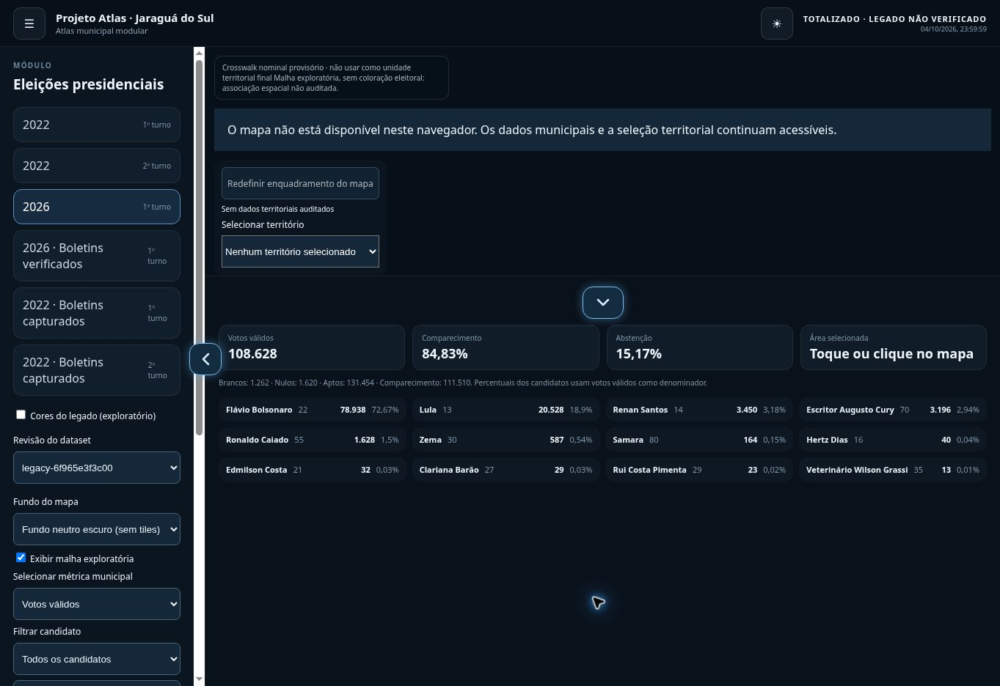

# Controles de painéis — 2026-10-09

O menu lateral e o painel inferior compartilham `PanelHandle`, um componente React de apresentação sem dependência de eleições, candidatos, anos ou revisões. A arquitetura de domínio e a resolução dos dados permanecem intactas.

## Uso

- Clique, toque, Enter ou Espaço na seta central alternam expansão e recolhimento.
- Arraste a alça lateral para a direita para abrir ou para a esquerda para recolher.
- Arraste a alça inferior para cima para expandir ou para baixo para recolher.
- O painel acompanha o gesto com deslocamento limitado e encaixa ao soltar, após 32 pixels. Deslocamentos entre 8 e 32 pixels não provocam clique involuntário.
- Cancelamento ou perda de captura restauram a posição sem alternar o estado.
- O controle lateral continua acessível quando o menu está fechado. Conteúdo fechado permanece `inert`.
- A seta indica a direção da próxima ação, tem alvo mínimo de 44 pixels, foco visível, `aria-expanded` e `aria-controls`.
- Brilho suave contínuo; `prefers-reduced-motion: reduce` desativa a animação e mantém brilho estático. Temas claro e escuro possuem cores próprias.
- Os gestos ficam nas alças, preservando a rolagem normal do conteúdo e os gestos do mapa. O estado inferior continua no parâmetro de URL `panel`.

## Validação

`panel-handles.spec.ts` cobre ambos os eixos em Chromium desktop e mobile: clique, teclado, mouse, toque nativo via CDP, captura fora do alvo, cancelamento de toque e preferência de movimento reduzido. O teste aguarda a estabilidade da alça antes de calcular as coordenadas durante a transição.

`safari.spec.ts` cobre clique, teclado e mouse em WebKit desktop e mobile. Toque nativo é validado em Chromium mobile; a simulação WebKit não representa uma validação em dispositivo iOS físico.

O smoke publicado verifica os dois controles com mouse e toque. A suíte anterior continua verificando dados, períodos/revisões, cores exploratórias, comparação, integridade, proveniência, URLs e WCAG. A referência visual neutra mobile foi atualizada e inspecionada: seta e brilho visíveis, dados de origem separados de totais municipais.

Nenhum dado de fonte, catálogo ou metodologia foi alterado. Não há resultado oficial inferido por bairro.

## Resultado da publicação

Commit de aplicação: [`6903da8`](https://github.com/alldevitone-maker/Atlas-Project/commit/6903da8731f29cb4c75a21064596d9ca94331694). Build, contratos, integridade, limites de arquivos e 24 testes core/21 unitários aprovados. Local: 52 E2E Chromium e 12 smokes contra o build local. GitHub Actions: 56 E2E Chromium/WebKit e 12 smokes no site publicado, todos aprovados.

- [Publicação e smoke ao vivo](https://github.com/alldevitone-maker/Atlas-Project/actions/runs/38006057657)
- [E2E Chromium/WebKit](https://github.com/alldevitone-maker/Atlas-Project/actions/runs/38006057604)
- [CI](https://github.com/alldevitone-maker/Atlas-Project/actions/runs/38006057607)
- [Build web](https://github.com/alldevitone-maker/Atlas-Project/actions/runs/38006057611)
- [Evidência estruturada](evidence/panel-gestures-validation.json)

Conferência manual no site publicado: cliques alternam os dois controles; arraste com mouse recolhe ambos; seta lateral permanece disponível com menu fechado. Brilho e direção das setas conferidos na captura abaixo. O navegador cloud não oferece WebGL; a imagem comprova a interface dos painéis. Renderização do mapa foi validada na suíte Chromium.

