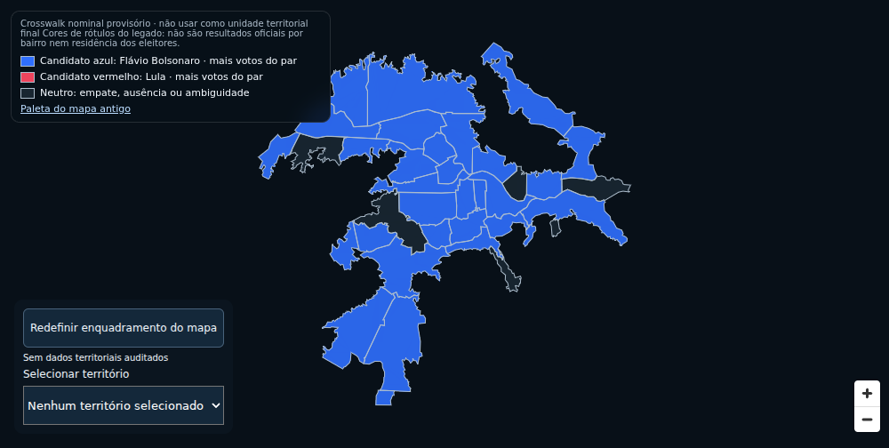
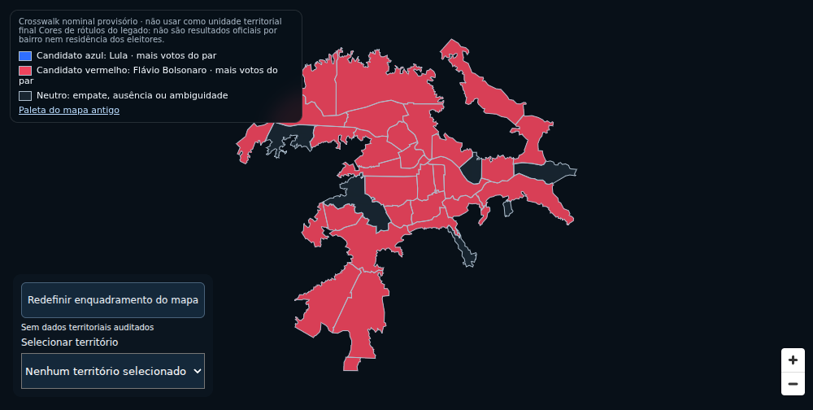
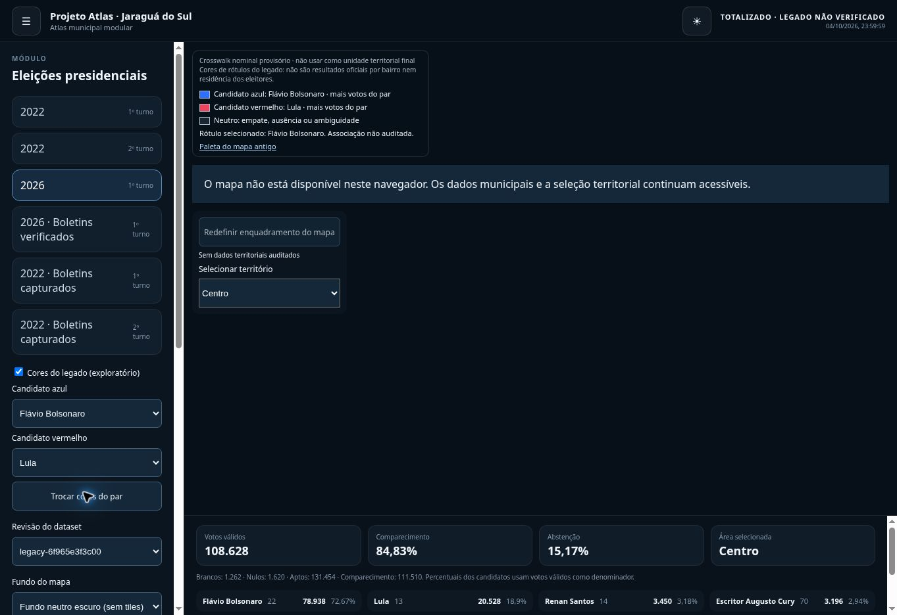

# Roadmap — cores de candidatos por apresentação herdada

Referência: roadmap v3.2 e [ADR-016](adr/ADR-016-candidate-presentation.md). Esta entrega habilita um protótipo exploratório explícito; não encerra as pendências de cartografia e proveniência espacial.

| Etapa | Entrega e aceite | Situação |
|---|---|---|
| 1 | Classe base genérica, adaptador eleitoral por herança, paleta/rótulos/par inicial configuráveis; renderer sem tags de candidatos | Implementado |
| 2 | Duas cores históricas, seletores do par, legenda textual e URL compartilhável; empate/ausência/ambiguidade neutros | Implementado |
| 3 | Aviso permanente de legado exploratório, nenhum total oficial de bairro, BU por seção sem associação territorial | Implementado |
| 4 | Testes de domínio, contratos, desktop/mobile, regressão visual, acessibilidade, build e budgets; deploy e smoke público | Concluído: gates e smoke público passaram |
| 5 | Auditar licença, geometria, vintage e correspondência territorial; publicar fonte georreferenciada e crosswalk com cobertura/erros | Pendente; requisito de promoção |
| 6 | Revisar metodologia espacial e aprovar comparação territorial com incerteza/supressão; atualizar gates e documentação antes de habilitar modo territorial oficial | Pendente; depende da etapa 5 |

## Uso e regra

Ative “Cores do legado (exploratório)” e escolha os candidatos azul/vermelho. A cor representa qual dos dois possui mais votos no rótulo legado. Não significa vitória sobre todos os candidatos nem residência dos eleitores. As identidades vêm do catálogo de cada eleição, sem continuidade presumida entre períodos. O mapa permanece neutro para fontes BU sem associação espacial auditada.

Link do protótipo: https://alldevitone-maker.github.io/Atlas-Project/?mapMode=legacy-pair

Os snapshots também invertem as posições do mesmo par para verificar ambas as cores sem alterar os dados. Seleção e reload devem preservar o modo e manter o valor territorial nulo. Não há nova ingestão ou modificação dos arquivos eleitorais nesta entrega.

## Evidências

[Implementação por herança](https://github.com/alldevitone-maker/Atlas-Project/commit/34f31b14e7a2f6ee9ce657fab77b33a947a0e5b6) · [Correção do fallback](https://github.com/alldevitone-maker/Atlas-Project/commit/0c62938b7436d21f9cf2fb9bee2ac07f83d9fc70).

- Local: foundation/AST/contratos PASS; 23 testes core, 21 unitários web e 46 E2E Chromium desktop/mobile PASS, sem atualizar os baselines neutros.
- Actions: [CI](https://github.com/alldevitone-maker/Atlas-Project/actions/runs/37880144293), [build](https://github.com/alldevitone-maker/Atlas-Project/actions/runs/37880144304), [E2E Chromium/WebKit](https://github.com/alldevitone-maker/Atlas-Project/actions/runs/37880144305) e [deploy + 8 smokes públicos](https://github.com/alldevitone-maker/Atlas-Project/actions/runs/37880144367) PASS. Gate de release: 48 E2E PASS.
- Budgets: JS inicial gzip 105.275/110.000 bytes; mapa gzip 279.611/300.000; worker 507.770/520.000.
- Inspeção manual pública: troca do par, seleção Centro e reload persistiram; valor territorial continuou nulo. O navegador remoto não oferece WebGL2. O fallback foi conferido e corrigido para não sobrepor a legenda. WebGL do site público foi validado pelo smoke do Actions. Uma tentativa local de screenshot público WebGL retornou ERR_EMPTY_RESPONSE; não foi usada como evidência de renderização.

[Registro estruturado](evidence/candidate-colors-validation.json). Acessibilidade automatizada não equivale a certificação WCAG completa.

### Prévia real do teste desktop (build local, modo exploratório)

### Site publicado no navegador remoto sem WebGL

