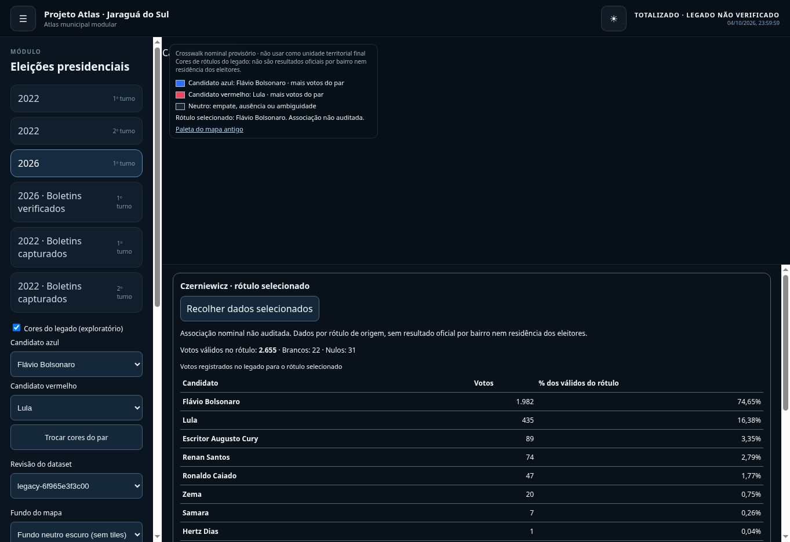

# Seleção no mapa: dados por rótulo de origem

O clique destacava o polígono e atualizava o nome selecionado, mas o painel mantinha somente os totais municipais. A seleção numérica nula era uma guarda metodológica; faltava uma consulta separada ao registro do legado, claramente identificada.

`SourceLabelResolver<Row>` define a consulta genérica por rótulo normalizado. `ElectionSourceLabelResolver<Row>` herda a consulta e fornece `sourceUnitId`. `ElectionPairPresentation` continua responsável somente pelas cores. `sourceUnitCandidates` calcula participações com os votos válidos do registro, enquanto `municipalCandidates` mantém o escopo municipal. Não há condicionais por ano, candidato ou número de urna.

Um registro único do legado abre o painel selecionado com contagens e candidatos do próprio rótulo. Os totais municipais ficam em seção distinta. Por exemplo, o legado 2026 de CZERNIEWICZ registra 2.655 válidos, incluindo 1.982 e 435 votos dos dois candidatos do par padrão; 108.628 continua sendo o total municipal. Esses valores não constituem verificação oficial de resultados por bairro.

Rótulos ausentes ou ambíguos não recebem contagens. Campos ausentes não são convertidos em zero. Fontes BU por seção não recebem associação nominal com bairros. A proveniência, revisão e rótulo de origem acompanham o painel; a seleção cartográfica continua com valor numérico nulo. Não foram modificados dados eleitorais ou catálogos.

A mesma implementação atende 2022 nos dois turnos, 2026 e suas revisões registradas. Novos períodos compatíveis usam o mesmo contrato; fontes incompatíveis exigem um adaptador e uma associação auditada, não uma condição hardcoded por ano.

Validação: teste de herança/normalização, ambiguidades e denominador do registro; E2E percorre todos os períodos e revisões legadas registrados, compara cada contagem ao payload carregado e confere reload e acessibilidade. Smoke público confere a seleção e a separação de escopos após o deploy.

## Validação e publicação

[Commit da correção](https://github.com/alldevitone-maker/Atlas-Project/commit/74ce538ce7aaa3b63613480173e3d4180cb780e1).

- Foundation/contratos/AST PASS, 24 testes core e 21 unitários web PASS.
- Regressão local: 48 E2E Chromium desktop/mobile PASS; após o ajuste do nome acessível, 2 testes focados de clique/toque, todos os períodos/revisões e axe PASS.
- [CI](https://github.com/alldevitone-maker/Atlas-Project/actions/runs/37889626063), [build](https://github.com/alldevitone-maker/Atlas-Project/actions/runs/37889626099), [E2E Chromium/WebKit](https://github.com/alldevitone-maker/Atlas-Project/actions/runs/37889625991) e [deploy + smoke público](https://github.com/alldevitone-maker/Atlas-Project/actions/runs/37889626047) PASS. Gate: 50 E2E; site publicado: 10 smokes PASS.
- JS inicial gzip 105.953/110.000 bytes; mapa gzip 279.610/300.000; worker 507.770/520.000.
- O baseline móvel neutro foi revisado para refletir o painel de seleção. As cores do mapa não foram modificadas. A recolha do painel reinicia seu scroll para preservar a visibilidade do título.
- Inspeção manual pública: Czerniewicz exibiu 2.655 válidos, votos de candidatos e percentuais sobre esse denominador; os 108.628 municipais ficaram separados. A seleção persistiu após reload. O navegador remoto não oferece WebGL2; a captura documenta o painel. Clique/toque e mapa com WebGL foram validados nos testes Chromium.

[Registro estruturado](evidence/selected-source-panel-validation.json). Os scans automatizados não equivalem a certificação WCAG completa.

